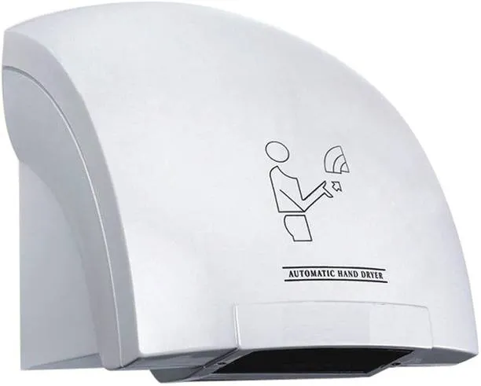
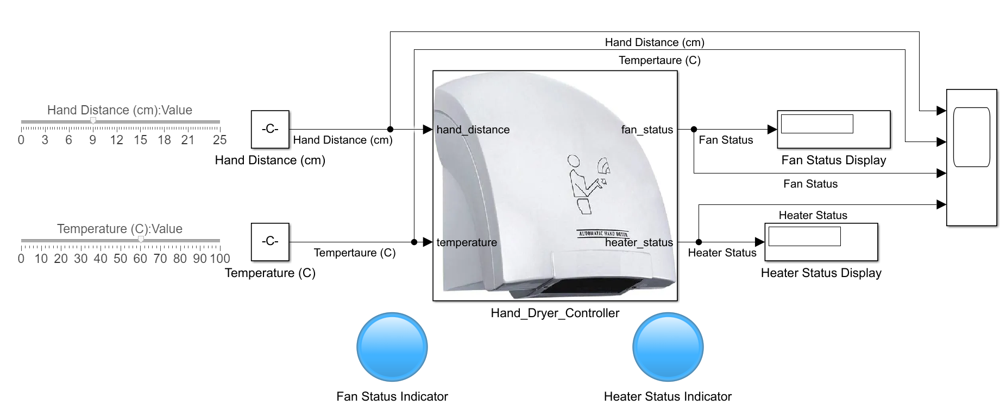
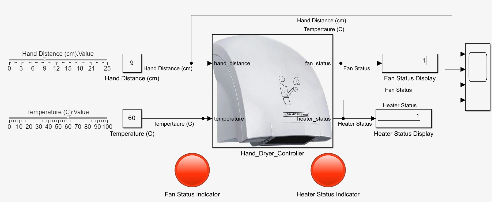
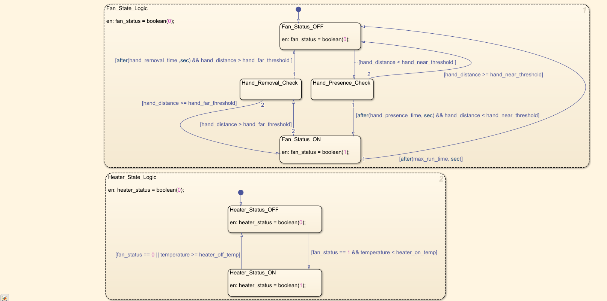
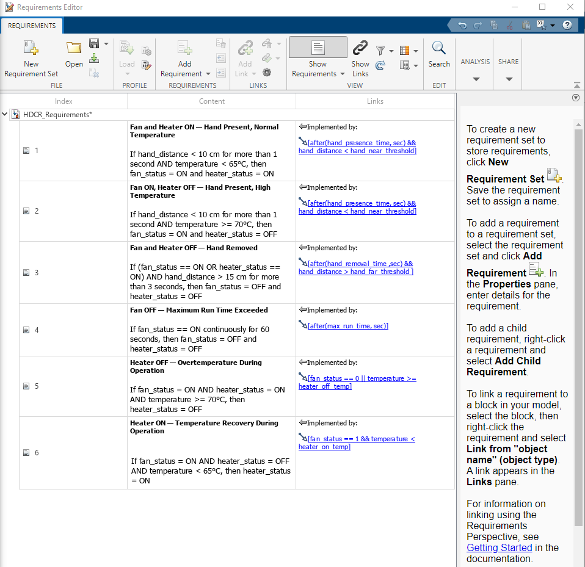
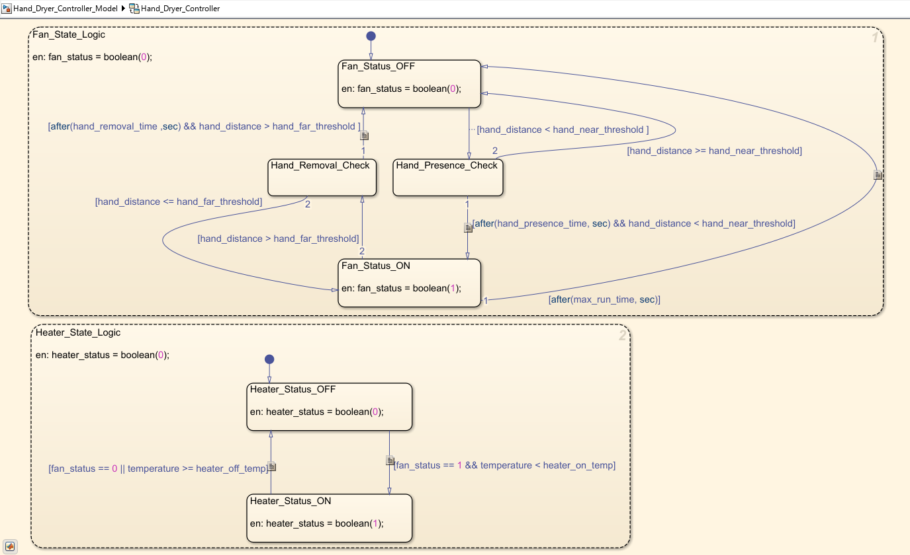
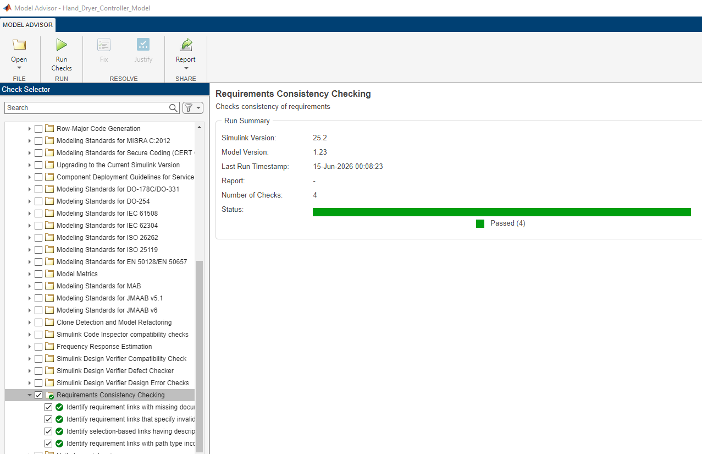
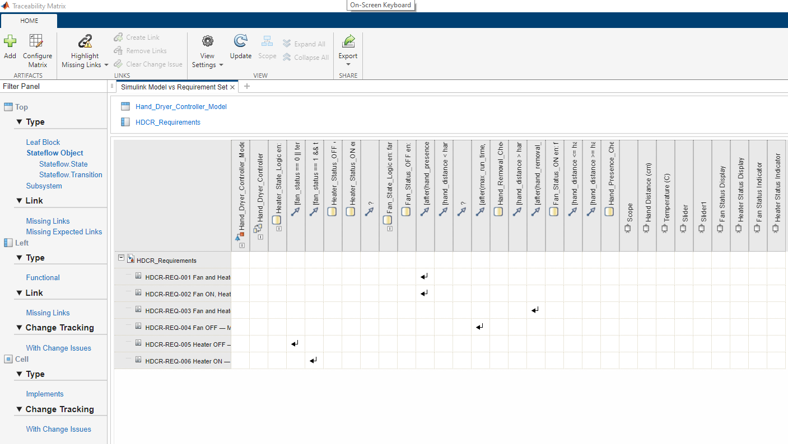
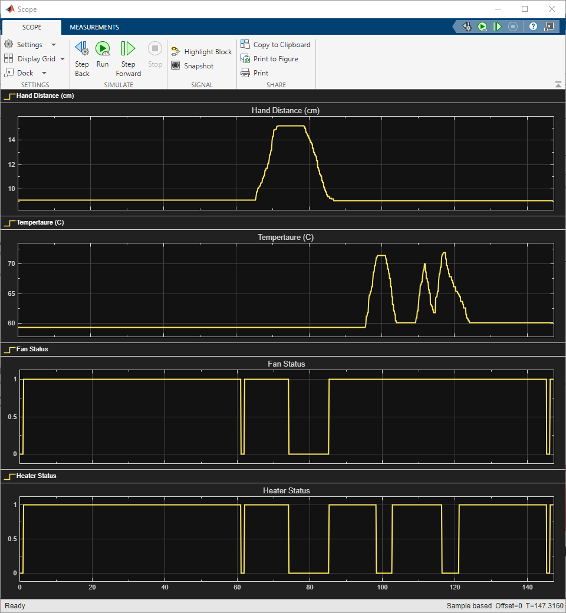

# Requirement-Based Hand Dryer Controller using Stateflow

A requirement-based automatic hand dryer controller implemented using MATLAB Stateflow, with full requirements traceability using Simulink Requirements Toolbox.

---



---

## Project Overview

This project implements a **Stateflow-based supervisory controller** for an automatic hand dryer using MATLAB/Simulink. The controller logic is developed directly from a set of functional requirements and verified through simulation scenarios covering all specified conditions.

The controller manages two output signals:

- `fan_status`: controls the fan
- `heater_status`: controls the heater

based on two input signals:

- `hand_distance`: proximity sensor reading in cm
- `temperature`: dryer temperature feedback in °C

The project demonstrates a **requirement-driven Model-Based Design (MBD) workflow** covering:

- Functional requirement authoring
- Stateflow supervisory logic development
- Requirement-to-model traceability using Simulink Requirements Toolbox
- Simulation-based verification
- Traceability matrix generation and export

---

## Project Objective

The objective of this project is to design and verify a hand dryer supervisory controller that:

- Detects hand presence using a proximity sensor with a confirmation delay
- Activates the fan and heater under normal temperature conditions
- Deactivates the heater during overtemperature conditions while keeping the fan running
- Reactivates the heater when temperature recovers below the lower threshold (hysteresis behavior)
- Shuts down the dryer when the hand is removed for a specified duration
- Shuts down the dryer after a maximum continuous run time as a safety measure
- Maintains full traceability between functional requirements and Stateflow implementation elements

---

## Repository Structure

```
Hand-Dryer-Controller/
│
├── images/
│   └── Screenshots and visual assets used in this README
│
├── model/
│   └── Hand_Dryer_Controller_Model.slx
│
├── requirements/
│   ├── HDCR_Requirements.xlsx
│   ├── HDCR_Requirements.slreqx
│   └── Hand_Dryer_Controller_Model~mdl.slmx
│
├── results/
│   ├── Simulation scope screenshots
│   ├── HDCR_Requirements_Matrix_SnapShot.pdf
│   ├── HDCR_Requirements_Matrix_SnapShot.xlsx
│   └── SLReqMatrixSnapShot.html
|     
└── README.md
```

---

## Tools Used

| Tool | Purpose |
|---|---|
| MATLAB | Script-based parameter definition |
| Simulink | Top-level model and signal routing |
| Stateflow | Supervisory control logic implementation |
| Simulink Requirements Toolbox | Requirements authoring, linking, and traceability |

---

## Top-Level Simulink Model

The top-level Simulink model contains:

- Dashboard sliders for interactive `hand_distance` and `temperature` input control during simulation
- `Hand_Dryer_Controller` Stateflow subsystem with a custom hand dryer icon
- Fan and heater status display blocks
- Dashboard lamp indicators (grey = OFF, red = ON, blue = undefined/pre-simulation)
- Scope block for full simulation output recording



The image below shows the model during an active simulation run with `hand_distance = 9 cm` and `temperature = 60°C`, confirming both fan and heater are ON:



---

## Input and Output Signals

| Signal Name | Type | Description | Unit |
|---|---|---|---|
| `hand_distance` | Input | Distance of hand from dryer proximity sensor | cm |
| `temperature` | Input | Dryer temperature feedback | °C |
| `fan_status` | Output | Fan command status (0 = OFF, 1 = ON) | Boolean |
| `heater_status` | Output | Heater command status (0 = OFF, 1 = ON) | Boolean |

---

## Controller Parameters

All parameters are defined as local data within the Stateflow chart. This is a deliberate design decision appropriate for a supervisory control implementation parameters are internal to the control logic and not intended as externally tunable calibration variables at this stage of model fidelity.

| Parameter | Value | Unit | Description |
|---|---|---|---|
| `hand_near_threshold` | 10 | cm | Hand is considered present below this distance |
| `hand_far_threshold` | 15 | cm | Hand is considered removed above this distance |
| `hand_presence_time` | 1 | sec | Confirmation delay before activating dryer |
| `hand_removal_time` | 3 | sec | Confirmation delay before deactivating dryer |
| `max_run_time` | 60 | sec | Maximum continuous fan ON duration |
| `heater_on_temp` | 65 | °C | Temperature below which heater is permitted to turn ON |
| `heater_off_temp` | 70 | °C | Temperature at or above which heater turns OFF |

> **Note:** The 5°C band between `heater_on_temp` (65°C) and `heater_off_temp` (70°C) implements deliberate hysteresis to prevent rapid heater switching near the threshold boundary.

---

## Stateflow Controller Design

The Stateflow chart is organized into two **parallel concurrent regions**, allowing fan and heater logic to execute independently and simultaneously:

- **Fan_State_Logic**: manages fan activation, deactivation, and safety timeout
- **Heater_State_Logic**: manages heater activation and overtemperature protection



### Fan_State_Logic

Manages hand detection with debounce confirmation and maximum run-time safety cutoff.

| State | Description |
|---|---|
| `Fan_Status_OFF` | Fan is OFF. Entry action sets `fan_status = 0` |
| `Hand_Presence_Check` | Intermediate state — confirms hand presence for `hand_presence_time` seconds |
| `Fan_Status_ON` | Fan is ON. Entry action sets `fan_status = 1` |
| `Hand_Removal_Check` | Intermediate state — confirms hand removal for `hand_removal_time` seconds |

Key transitions:
- `Fan_Status_OFF → Hand_Presence_Check` when `hand_distance < hand_near_threshold`
- `Hand_Presence_Check → Fan_Status_ON` after `hand_presence_time` seconds with hand still present
- `Fan_Status_ON → Hand_Removal_Check` when `hand_distance > hand_far_threshold`
- `Hand_Removal_Check → Fan_Status_OFF` after `hand_removal_time` seconds with hand still removed
- `Fan_Status_ON → Fan_Status_OFF` after `max_run_time` seconds (safety timeout)

### Heater_State_Logic

Manages heater activation based on fan state and temperature, implementing overtemperature protection with hysteresis.

| State | Description |
|---|---|
| `Heater_Status_OFF` | Heater is OFF. Entry action sets `heater_status = 0` |
| `Heater_Status_ON` | Heater is ON. Entry action sets `heater_status = 1` |

Key transitions:
- `Heater_Status_OFF → Heater_Status_ON` when `fan_status == 1 AND temperature < heater_on_temp`
- `Heater_Status_ON → Heater_Status_OFF` when `fan_status == 0 OR temperature >= heater_off_temp`

---

## Functional Requirements

| Requirement ID | Requirement Description | Priority |
|---|---|---|
| HDCR-REQ-001 | If `hand_distance < 10 cm` for more than 1 second AND `temperature < 65°C`, then `fan_status = ON` and `heater_status = ON` | Critical |
| HDCR-REQ-002 | If `hand_distance < 10 cm` for more than 1 second AND `temperature >= 70°C`, then `fan_status = ON` and `heater_status = OFF` | Critical |
| HDCR-REQ-003 | If (`fan_status == ON` OR `heater_status == ON`) AND `hand_distance > 15 cm` for more than 3 seconds, then `fan_status = OFF` and `heater_status = OFF` | Critical |
| HDCR-REQ-004 | If `fan_status == ON` continuously for 60 seconds, then `fan_status = OFF` and `heater_status = OFF` | Critical |
| HDCR-REQ-005 | If `fan_status = ON` AND `heater_status = ON` AND `temperature >= 70°C`, then `heater_status = OFF` | Critical |
| HDCR-REQ-006 | If `fan_status = ON` AND `heater_status = OFF` AND `temperature < 65°C`, then `heater_status = ON` | Critical |

---

## Requirements Traceability

Requirements were authored in Simulink Requirements Toolbox and formally linked to the corresponding Stateflow transitions that implement them.

### Traceability Workflow

```
Functional Requirements (Excel)
        ↓
Requirements Toolbox Requirement Set (.slreqx)
        ↓
Traceability Links to Stateflow Transitions (.slmx)
        ↓
Consistency Check (Model Advisor)
        ↓
Traceability Matrix Export (.pdf / .xlsx)
```

### Requirements Editor — Document View

The document view below shows each requirement alongside its linked Stateflow implementation element:



### Stateflow Chart with Requirement Links

Traceability badges are visible on linked transitions in the chart:



### Consistency Check

All requirements passed the Simulink Requirements consistency check with no missing or broken links:



### Traceability Matrix

The traceability matrix below confirms that every requirement maps to atleast one Stateflow implementation element, achieving 100% requirements coverage:



The full traceability matrix is available in the `results/` folder in both PDF and Excel formats.

---

## Simulation and Verification
The model was simulated using a **fixed-step discrete solver with a 0.001-second step size.** This small step size was selected to clearly capture interactive dashboard-slider input variations and observe the corresponding fan/heater status transitions in the scope output. The input signals were controlled interactively using dashboard sliders to exercise each requirement scenario.

### Simulation Scope Result

The scope output below shows `hand_distance`, `temperature`, `fan_status`, and `heater_status` across a multi-scenario simulation run:



### Verification Summary

| Req. ID | Test Scenario | Expected Result | Observed Result | Status |
|---|---|---|---|---|
| HDCR-REQ-001 | `hand_distance = 9 cm`, `temperature = 60°C`, hand held for > 1 sec | `fan_status = 1`, `heater_status = 1` | `fan_status = 1`, `heater_status = 1` at t = 1s | ✅ Pass |
| HDCR-REQ-002 | `hand_distance = 9 cm`, `temperature = 70°C`, hand held for > 1 sec | `fan_status = 1`, `heater_status = 0` | `fan_status = 1`, `heater_status = 0` confirmed in scope | ✅ Pass |
| HDCR-REQ-003 | `hand_distance = 16 cm` after active operation, held for > 3 sec | `fan_status = 0`, `heater_status = 0` | Both outputs drop to 0 after 3-second removal delay | ✅ Pass |
| HDCR-REQ-004 | Fan ON continuously from t = 0 with hand present | `fan_status = 0` at t = 60s | `fan_status = 0` observed at t = 60s in scope | ✅ Pass |
| HDCR-REQ-005 | `fan_status = 1`, `heater_status = 1`, temperature rises to 70°C | `heater_status = 0` | `heater_status` drops to 0 when temperature reaches 70°C | ✅ Pass |
| HDCR-REQ-006 | `fan_status = 1`, `heater_status = 0`, temperature drops below 65°C | `heater_status = 1` | `heater_status` returns to 1 when temperature drops below 65°C | ✅ Pass |

---

## Key Debugging Note: Entry Action vs During Action

During verification of HDCR-REQ-004 (maximum run-time timeout), the fan OFF transition was confirmed firing correctly in the Stateflow chart at t = 60s, but `fan_status` was not reflecting the change in the scope output.

**Root cause:** The `Fan_Status_OFF` state was using a `during` action (`du: fan_status = boolean(0)`). A during action does not execute on the same time step as state entry, it executes on the *following* step. With a 1-second fixed step size, this caused a full 1-second output lag on the timeout transition.

**Fix:** The state action was changed from `du` (during) to `en` (entry):

```
en: fan_status = boolean(0)
```

This ensures `fan_status` is set to 0 immediately upon entering `Fan_Status_OFF`, giving deterministic output on state entry.

**Design principle internalized:**

| Situation | Correct Action Type |
|---|---|
| Output represents the value of being IN this state | `en` (entry action) |
| Output is continuously recomputed from inputs each step | `du` (during action) |

For supervisory controllers where outputs represent fixed state values, `en` is the correct action type throughout.

---

## Key Learning Outcomes

Through this project, I gained practical exposure to the following MBD concepts:

- Decomposing functional requirements into Stateflow supervisory logic
- Designing parallel concurrent state regions for independent subsystem control
- Implementing temporal logic using `after()` for confirmation delays
- Implementing heater hysteresis using separate ON and OFF temperature thresholds
- Understanding the behavioral difference between entry (`en`) and during (`du`) state actions
- Debugging output assignment issues through Stateflow chart animation
- Authoring requirements in Simulink Requirements Toolbox
- Linking requirements to Stateflow implementation elements
- Running consistency checks and generating traceability matrices

---

## Future Improvements

As per standard MBD workflow practice, the following enhancements are planned:

- Promote `hand_presence_time`, `hand_removal_time`, and threshold parameters as externally tunable when model fidelity requires calibration-level access
- Add a cooldown or timeout lockout state after `max_run_time` expires
- Create formal test cases using Simulink Test
- Add pass/fail signal assertions linked to requirements
- Link verification results directly to requirement objects
- Generate model coverage reports
- Extend the controller with fault detection and handling logic

---

## License

MIT License

---
